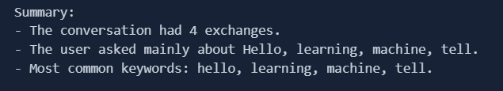

<h1>AI Chat Log Summarizer</h1>

This Python task performs simple conversational analysis by parsing a dialog file between a user and an AI assistant.It tokenizes, filters and uses <strong>TF-IDF (Term Frequency-Inverse Document Frequency)</strong> to extract the most significant keywords from user inputs.

<h2>Features</h2>
<ul>
  <li>Parses structured chat logs (<code>User:</code> and <code>AI:</code> prefixes)</li>
  <li>Tokenizes and cleans messages</li>
  <li>Removes stopwords and punctuation</li>
  <li>Extracts top keywords from user messages using TF-IDF</li>
  <li>Generates a brief summary of the conversation</li>
</ul>

<h2>Example Use Case</h2>

<strong>Input file format (data.txt):</strong>

<pre><code>User : Hello, how are you?
AI : I'm good, thank you! How can I assist?
User : Tell me about machine learning.
AI : Machine learning is a field of AI that enables systems to learn from data.
</code></pre>

<strong>Sample Output:</strong>

<pre><code>Summary:
- The conversation had 4 exchanges.
- The user asked mainly about Hello, learning, machine, tell.
- Most common keywords: hello, learning, machine, tell.
</code></pre>

<h2>How to Run</h2>

<h3>1. Clone the repository</h3>
<pre><code>git clone https://github.com/yourusername/tfidf-chat-analysis.git
cd tfidf-chat-analysis
</code></pre>

<h3>2. Install Requirements</h3>
<pre><code>pip install tensorflow matplotlib nltk scikit-learn
</code></pre>

<h3>3. Download NLTK Stopwords</h3>
<pre><code>import nltk
nltk.download('stopwords')
</code></pre>

<h3>4. Run the Script</h3>
<pre><code>python task.ipynb
</code></pre>

<h2>Sample Test Case</h2>

<pre><code>
msg = [User: Hello!
AI: Hi! How can I assist you today?
User: Can you explain what machine learning is?
AI: Certainly! Machine learning is a field of AI that allows systems to
learn from data.]

### output : Summary:
- The conversation had 4 exchanges.
- The user asked mainly about Hello, learning, machine, tell.
- Most common keywords: hello, learning, machine, tell. 
</code></pre>

<h2>Screenshots</h2>

<h2>File Structure</h2>
<pre><code>.
├── data.txt                 #Sample chat data
├── task.ipynb               #Main script
├── README.md                #Project documentation
└── assets/                  #Screenshots
</code></pre>

<h2>Author</h2>

 Tishad 

